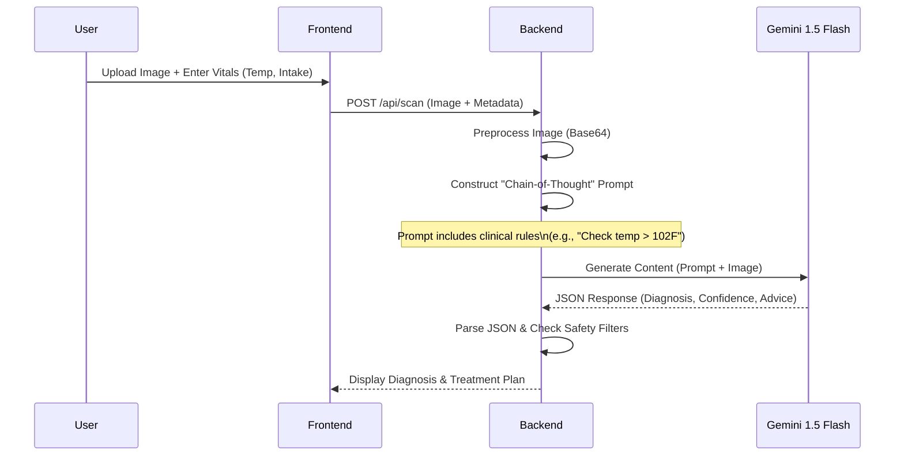
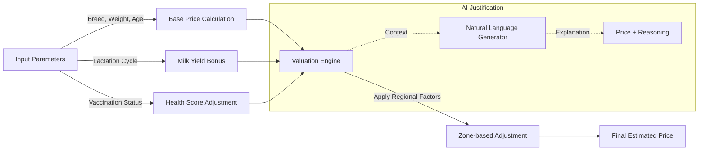

# System Architecture Diagrams

## Figure 1: High-Level System Architecture
```mermaid
graph TD
    User[Farmer / User] -->|HTTPS| Frontend[React Frontend\n(Netlify/Vercel)]
    Frontend -->|REST API| API_Gateway[API Gateway / Load Balancer]
    API_Gateway -->|Requests| Backend[Flask Backend Server]
    
    subgraph "Application Layer"
        Backend -->|Auth| Auth_Module[Authentication Service]
        Backend -->|Business Logic| Trade_Engine[Smart Trade Engine]
        Backend -->|Orchestration| AI_Handler[AI Request Handler]
    end
    
    subgraph "Data Layer"
        Backend -->|Read/Write| DB[(MongoDB / In-Memory Store)]
        DB -->|Persist| User_Data[User Profiles]
        DB -->|Persist| Health_Logs[Health Records]
    end
    
    subgraph "Intelligence Layer (External)"
        AI_Handler -->|API Call| Gemini[Google Gemini 1.5 Flash]
        Gemini -->|Response| AI_Handler
    end
```

## Figure 2: Multimodal Disease Detection Pipeline


## Figure 3: Smart Trade Valuation Logic

